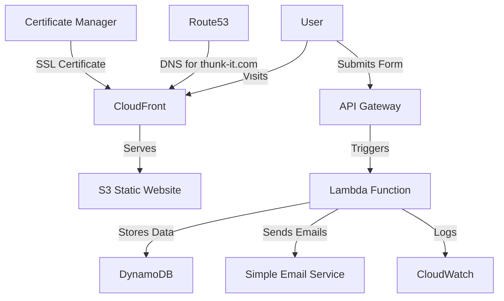

# Design Document: Business Contact Form

## Overview

This design document outlines the architecture and implementation details for a cost-effective business contact web form application built with Node.js and React, to be hosted on AWS. The application will be deployed under the domain "thunk-it.com" which is registered with AWS Route53. The primary goal is to create a simple, efficient way for potential clients to contact the business while keeping AWS hosting costs as low as possible.

## Architecture

The application will follow a serverless architecture to minimize costs while maintaining scalability and reliability. The architecture consists of the following components:

### Frontend
- Single-page React application hosted on AWS S3 and delivered via CloudFront
- Responsive design using modern CSS frameworks
- Form validation on the client side

### Backend
- AWS Lambda functions for processing form submissions
- API Gateway to expose Lambda functions as RESTful endpoints
- DynamoDB for storing form submissions
- SES (Simple Email Service) for sending email notifications
- CloudWatch for monitoring and logging

### Infrastructure
- Route53 for DNS management of "thunk-it.com"
- S3 for static website hosting
- CloudFront for content delivery
- AWS Certificate Manager for SSL/TLS certificates

### Architecture Diagram



## Components and Interfaces

### Frontend Components

1. **Contact Form Component**
   - Input fields: Name, Email, Phone, Company, Message
   - Validation logic
   - Submission handling
   - Success/Error messaging

2. **Form Validation Service**
   - Email format validation
   - Required field validation
   - Phone number format validation

3. **API Service**
   - Handles communication with backend API
   - Manages request/response lifecycle
   - Handles errors and retries

### Backend Components

1. **Form Submission Lambda**
   - Validates incoming data
   - Stores submission in DynamoDB
   - Triggers email notifications
   - Returns appropriate response

2. **Email Notification Service**
   - Sends confirmation email to user
   - Sends notification email to business owner
   - Uses templated emails

3. **Admin API Lambda**
   - Authenticates admin users
   - Retrieves form submissions
   - Updates submission status

### Interfaces

#### API Endpoints

1. **POST /api/contact**
   - Accepts form submission data
   - Returns success/failure response

2. **GET /api/submissions** (Admin only)
   - Returns list of form submissions
   - Supports filtering and pagination

3. **PUT /api/submissions/:id** (Admin only)
   - Updates submission status
   - Returns updated submission

## Data Models

### Contact Submission

```typescript
interface ContactSubmission {
  id: string;              // UUID
  name: string;            // Full name of the person
  email: string;           // Email address
  phone?: string;          // Optional phone number
  company?: string;        // Optional company name
  message: string;         // The inquiry message
  timestamp: string;       // ISO format date/time
  status: SubmissionStatus;// Current status
  ipAddress: string;       // For spam prevention
  userAgent: string;       // Browser info
}

enum SubmissionStatus {
  NEW = 'new',
  VIEWED = 'viewed',
  RESPONDED = 'responded',
  COMPLETED = 'completed',
  SPAM = 'spam'
}
```

### DynamoDB Schema

**Table: ContactSubmissions**

| Attribute  | Type   | Description                    |
|------------|--------|--------------------------------|
| id         | String | Partition key, UUID            |
| timestamp  | String | Sort key, ISO format date/time |
| name       | String | Submitter's name               |
| email      | String | Submitter's email              |
| phone      | String | Submitter's phone (optional)   |
| company    | String | Company name (optional)        |
| message    | String | Inquiry message                |
| status     | String | Current status                 |
| ipAddress  | String | Submitter's IP address         |
| userAgent  | String | Submitter's browser info       |

## Error Handling

### Frontend Error Handling

1. **Form Validation Errors**
   - Display inline error messages for invalid fields
   - Prevent submission until all errors are resolved

2. **API Communication Errors**
   - Display user-friendly error messages
   - Implement retry mechanism for transient failures
   - Log errors to console for debugging

### Backend Error Handling

1. **Lambda Function Errors**
   - Log detailed error information to CloudWatch
   - Return appropriate HTTP status codes
   - Implement error monitoring and alerting

2. **Database Errors**
   - Implement retry with exponential backoff
   - Log failed operations
   - Return graceful error responses

3. **Email Sending Errors**
   - Queue failed emails for retry
   - Log email delivery failures
   - Alert administrator for persistent failures

## Testing Strategy

### Frontend Testing

1. **Unit Tests**
   - Test form validation logic
   - Test API service functions
   - Test UI component rendering

2. **Integration Tests**
   - Test form submission flow
   - Test error handling scenarios
   - Test responsive design

3. **End-to-End Tests**
   - Test complete user journey
   - Test across different browsers and devices

### Backend Testing

1. **Unit Tests**
   - Test Lambda function logic
   - Test validation functions
   - Test email formatting

2. **Integration Tests**
   - Test API Gateway to Lambda integration
   - Test Lambda to DynamoDB integration
   - Test Lambda to SES integration

3. **Load Tests**
   - Test system under expected load
   - Identify performance bottlenecks

## Security Considerations

1. **Data Protection**
   - Encrypt data at rest in DynamoDB
   - Use HTTPS for all communications
   - Implement appropriate IAM policies

2. **API Security**
   - Implement rate limiting
   - Use AWS WAF for additional protection
   - Validate and sanitize all input

3. **Admin Access**
   - Implement secure authentication
   - Use least privilege principle for IAM roles
   - Audit admin actions

## Cost Optimization

1. **Serverless Architecture**
   - Pay only for actual usage
   - No always-on servers to maintain

2. **AWS Free Tier Utilization**
   - Lambda: 1M free requests per month
   - DynamoDB: 25GB storage and RCU/WCU within free tier
   - S3: 5GB storage within free tier
   - CloudFront: 1TB data transfer out per month within free tier

3. **Scaling Strategy**
   - Auto-scaling based on demand
   - No over-provisioning of resources

4. **Approximate Monthly Costs**

| Service | Usage Estimate | Monthly Cost (USD) | Notes |
|---------|----------------|-------------------|-------|
| Route 53 | 1 hosted zone | $0.50 | Fixed cost for domain hosting |
| S3 | < 5GB storage | $0.00 | Within free tier |
| CloudFront | < 10GB transfer | $0.00 | Within free tier |
| Lambda | < 1M requests | $0.00 | Within free tier |
| API Gateway | < 1M requests | $0.00 | Within free tier |
| DynamoDB | < 25GB storage | $0.00 | Within free tier |
| SES | 1000 emails | $0.10 | $0.10 per 1000 emails |
| Certificate Manager | 1 certificate | $0.00 | Free for CloudFront distributions |
| **Total Estimated Cost** | | **$0.60 - $2.00** | Depends on traffic volume |

For a low-traffic business contact form (< 1000 submissions per month), most services will remain within the AWS free tier. The primary fixed cost is the Route 53 hosted zone ($0.50/month). If traffic increases significantly, costs would scale primarily in API Gateway, Lambda, and SES usage, but would likely remain under $5-10/month for moderate usage.

## Deployment Strategy

1. **Infrastructure as Code**
   - Use AWS CDK or CloudFormation for infrastructure deployment
   - Version control all infrastructure code

2. **CI/CD Pipeline**
   - Automated testing before deployment
   - Staged deployments (dev, staging, production)
   - Rollback capability

3. **Monitoring and Maintenance**
   - CloudWatch dashboards for monitoring
   - Automated alerts for critical issues
   - Regular security updates
## Infrast
ructure as Code Tool Selection

### Terraform vs. AWS CDK Cost Implications

The choice between Terraform and AWS CDK for infrastructure as code does not directly impact the AWS service costs, as both tools ultimately provision the same AWS resources. The cost differences are primarily related to development and maintenance:

1. **Development Costs**:
   - Terraform has a larger community and more examples for AWS deployments
   - AWS CDK may require less code for AWS-specific resources
   - Both tools are free and open-source

2. **Operational Costs**:
   - Terraform state can be stored in S3 (minimal cost, within free tier)
   - AWS CDK uses CloudFormation (free service)
   - Neither tool adds significant AWS costs to the project

3. **Maintenance Costs**:
   - Both require similar effort for ongoing maintenance
   - Team familiarity with either tool may impact development efficiency

For this project, the choice between Terraform and AWS CDK will not materially affect the AWS infrastructure costs. The estimated monthly costs provided earlier remain accurate regardless of which IaC tool is selected.## Most
 Cost-Effective Infrastructure Approach

After evaluating different infrastructure as code options, the AWS Serverless Application Model (SAM) represents the most cost-effective approach for this project:

1. **Development Cost Benefits**:
   - SAM provides simplified syntax specifically designed for serverless applications
   - Built-in local testing capabilities reduce development costs
   - Direct integration with AWS services minimizes configuration errors
   - Free to use with no additional charges

2. **Operational Cost Benefits**:
   - Zero cost for CloudFormation service usage
   - Optimized deployment process reduces Lambda cold starts
   - Built-in best practices for serverless resource configuration
   - Simplified permissions management reduces security risks

3. **Maintenance Cost Benefits**:
   - AWS maintains the SAM framework, ensuring compatibility with latest services
   - Simplified updates and changes to infrastructure
   - Reduced complexity compared to general-purpose IaC tools

For this project, using AWS SAM will provide the most cost-effective approach by simplifying serverless development, reducing potential configuration errors, and leveraging AWS's free infrastructure deployment tools.